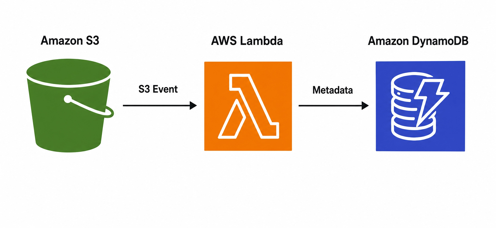

# Automating-Metadata-Flow-from-S3-to-DynamoDB-with-AWS-Lambda
This guide provides a detailed, step-by-step approach to implementing an automated metadata extraction and storage solution using Amazon S, AWS Lambda, and AmazonDynamoDB. This architecture is ideal for scenarios where you need to process newly uploaded files in S3, extract specific metadata, and store it in a highly scalable NoSQL database for quick retrieval and analysis. This pattern is fundamental for building data lakes, content management systems, digital asset management,complianace and auditing and event-driven architectures.

# Architecture Overview
The solution leverages three core AWS services:
- **Amazon S3 (Simple Storage Service)**: Acts as the primary storage for your files. When a new object is uploaded to a designated S3 bucket, it triggers an event.
- **AWS Lambda**: A serverless compute service that executes code in response to events. In this architecture, Lambda is triggered by S3 object creation events. It extracts relevant metadata from the S3 object and prepares it for storage.
- **Amazon DynamoDB**: A fast, flexible NoSQL database service for single-digit millisecond performance at any scale. It will store the extracted metadata, making it easily queryable.

## Architecture

The flow is straightforward: an **S3 Event** (e.g., a new file upload) triggers an **AWS Lambda** function, which then extracts **Metadata** from the S3 object and writes it to an **Amazon DynamoDB table**.

## Author
Rhoda Ndege
Cloud Engineer
